<div align="center">


# VanLife News

**The mobile app for [coffee.bez.coffee](https://coffee.bez.coffee?utm_source=github&utm_medium=readme&utm_campaign=app-releases) — your campervan & vanlife companion**

[](https://github.com/Kopaev/VanLife-App-Releases/releases/latest)
[](https://github.com/Kopaev/VanLife-App-Releases/releases)
[](https://github.com/Kopaev/VanLife-App-Releases/releases/latest)

[**⬇ Download APK**](https://github.com/Kopaev/VanLife-App-Releases/releases/latest/download/VanLife.apk) &nbsp;·&nbsp;
[All releases](https://github.com/Kopaev/VanLife-App-Releases/releases) &nbsp;·&nbsp;
[Website](https://coffee.bez.coffee?utm_source=github&utm_medium=readme&utm_campaign=app-releases)

</div>

---

## About

**VanLife News** is the official Android app for [coffee.bez.coffee](https://coffee.bez.coffee?utm_source=github&utm_medium=readme&utm_campaign=app-releases) — a news and community platform dedicated to campervans, caravans, motorhomes, and the van life movement.

The website and app aggregate content from hundreds of sources worldwide, bringing together everything that matters to people living and traveling in their vehicles:

- 🗞️ **Latest news** from the global campervan & caravan community — regulations, new models, travel stories, and lifestyle
- 🎪 **Upcoming events** — camping fairs, RV exhibitions, vanlife festivals, and meetups around the world
- 🧭 **Travel tools** built for nomads — visa calculators, currency converter, and more

The project is available in **7 languages**, covering communities across Europe, Russia, Turkey, and Latin America.

---

## Screenshots

### Features

<div align="center">
<table>
  <tr>
    <td align="center">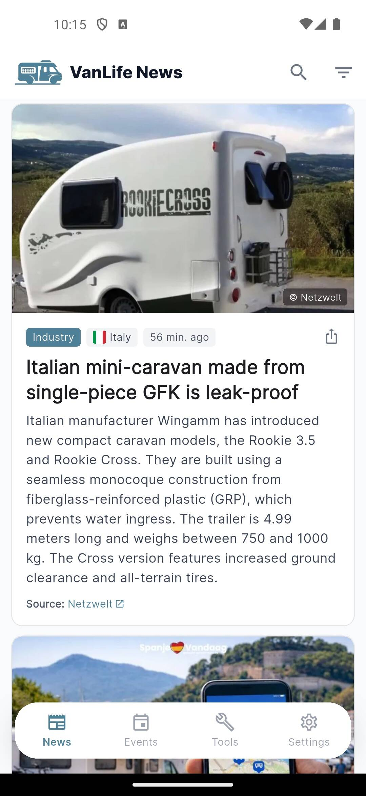<br/><sub>News Feed</sub></td>
    <td align="center">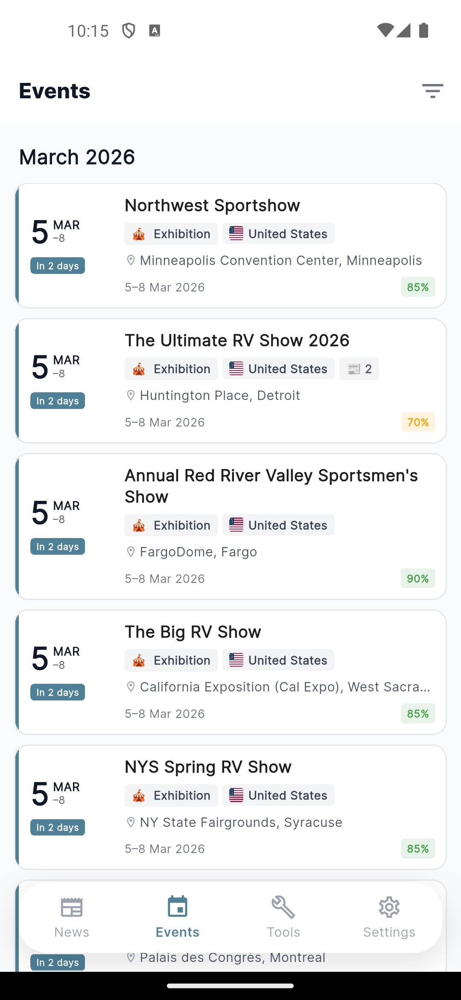<br/><sub>Events</sub></td>
    <td align="center">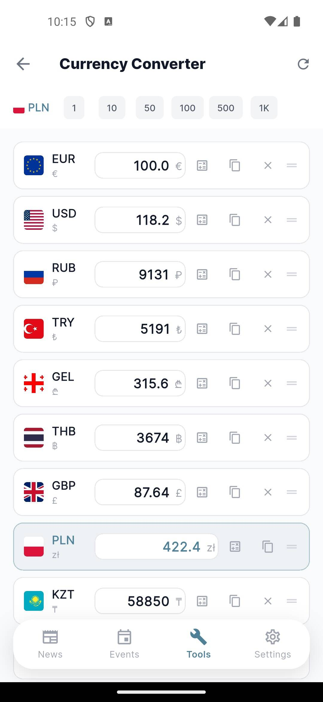<br/><sub>Currency Converter</sub></td>
    <td align="center">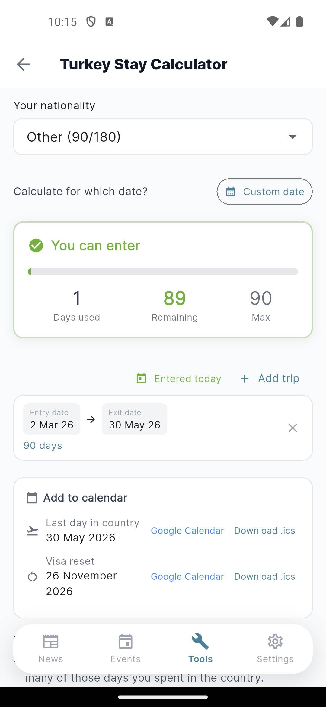<br/><sub>Visa Calculator</sub></td>
  </tr>
  <tr>
    <td align="center">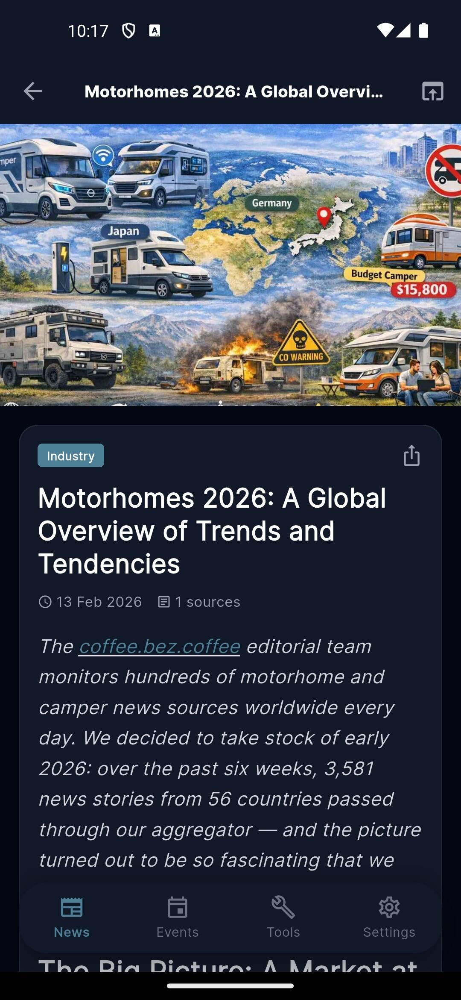<br/><sub>Article Detail</sub></td>
    <td align="center">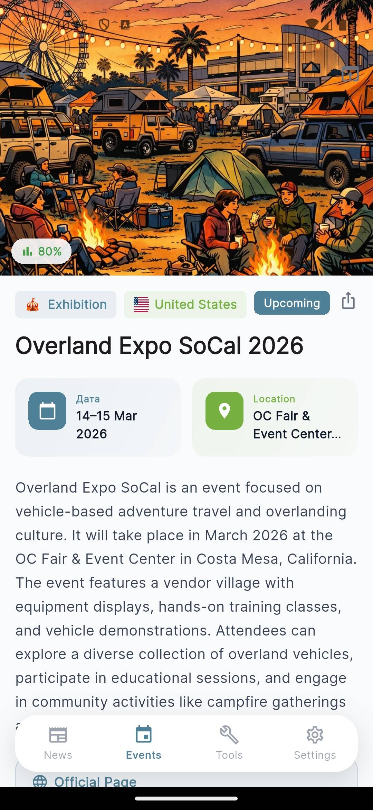<br/><sub>Event Detail</sub></td>
    <td align="center">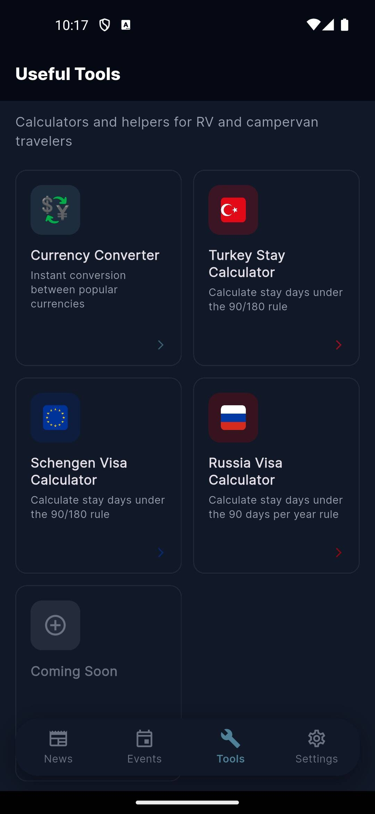<br/><sub>Tools</sub></td>
    <td align="center">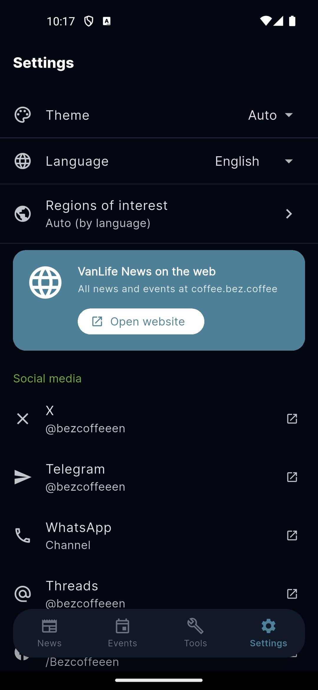<br/><sub>Settings</sub></td>
  </tr>
  <tr>
    <td align="center">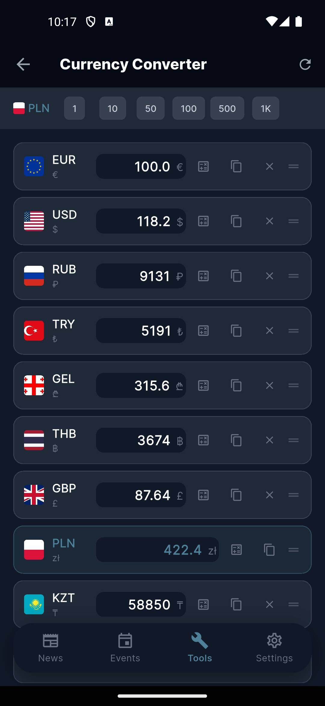<br/><sub>Currency · Dark</sub></td>
    <td align="center">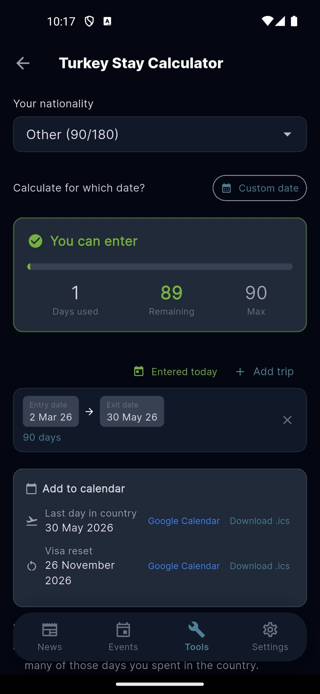<br/><sub>Visa Calculator · Dark</sub></td>
    <td align="center">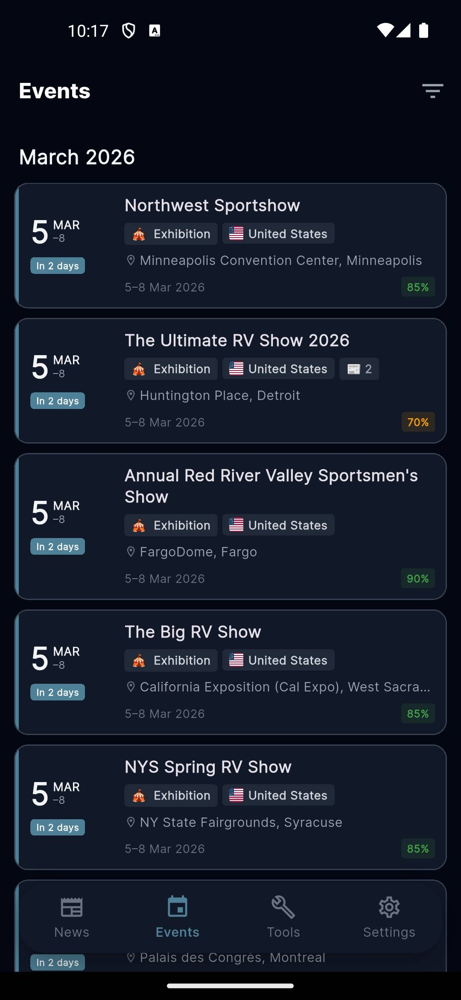<br/><sub>Events · Dark</sub></td>
    <td align="center">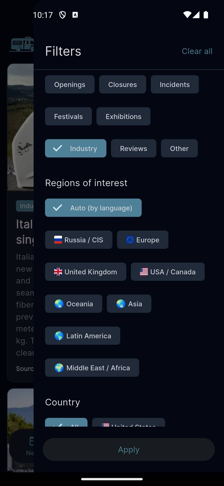<br/><sub>News Filters</sub></td>
  </tr>
</table>
</div>

### 7 Languages

<div align="center">
<table>
  <tr>
    <td align="center">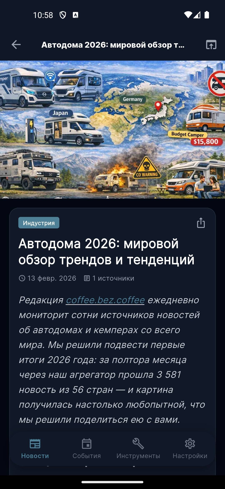<br/><sub>🇷🇺 Русский</sub></td>
    <td align="center">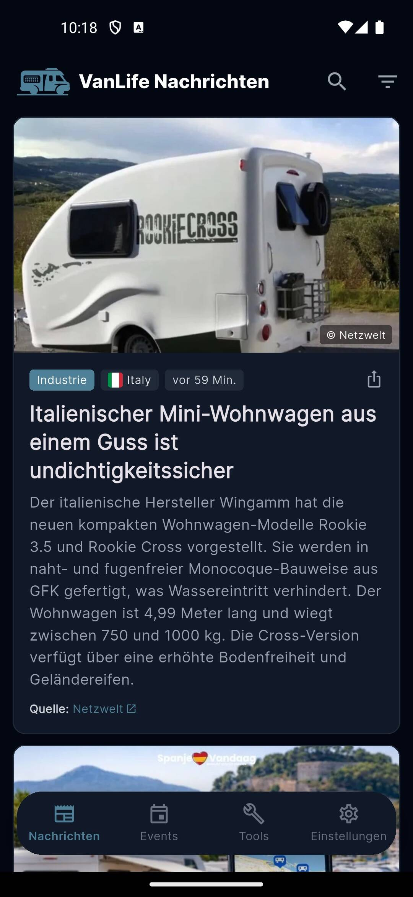<br/><sub>🇩🇪 Deutsch</sub></td>
    <td align="center">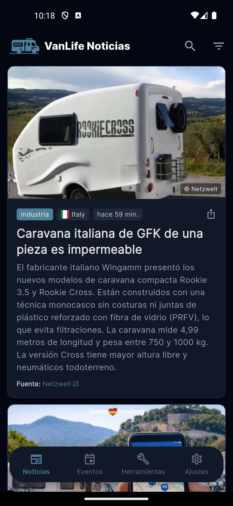<br/><sub>🇪🇸 Español</sub></td>
    <td align="center">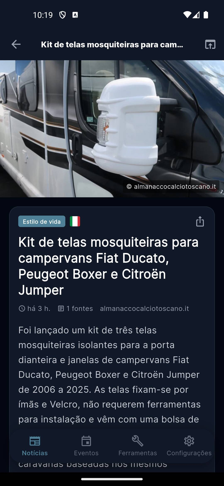<br/><sub>🇧🇷 Português</sub></td>
  </tr>
  <tr>
    <td align="center">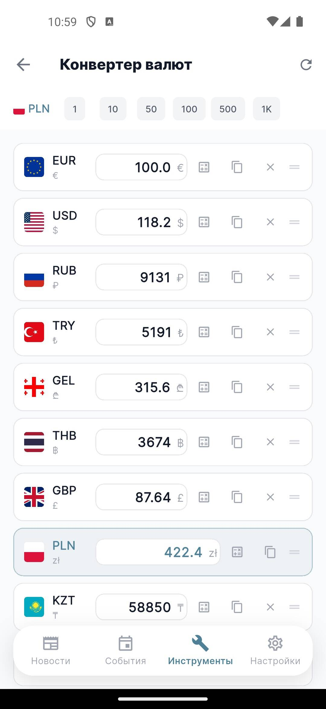<br/><sub>🇷🇺 Currency · Русский</sub></td>
    <td align="center">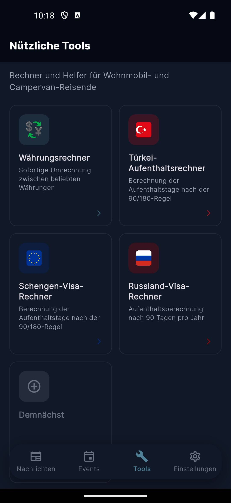<br/><sub>🇩🇪 Tools · Deutsch</sub></td>
    <td align="center">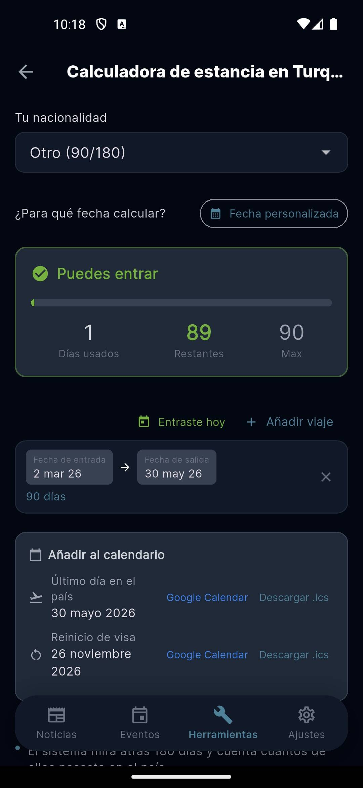<br/><sub>🇪🇸 Visa · Español</sub></td>
    <td align="center">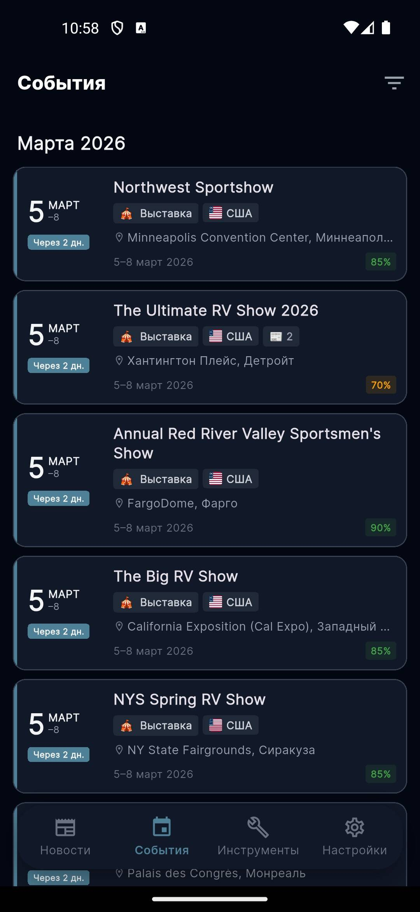<br/><sub>🇷🇺 Events · Русский</sub></td>
  </tr>
</table>
</div>

> Also available in 🇫🇷 Français and 🇹🇷 Türkçe

---

## Features

| | |
|---|---|
| 📰 **News Feed** | Aggregated van life news from 100+ sources, filtered by country, category, and language |
| 📅 **Events** | Upcoming camping fairs, RV shows, and vanlife festivals worldwide |
| 💱 **Currency Converter** | 24 currencies with offline support, quick amounts, and drag-to-reorder |
| 🛂 **Visa Calculators** | Turkey 90/180 rule, Schengen 90/180, Russia 90/year — with trip history |
| 🌙 **Dark Mode** | Full dark theme support |
| 🌍 **7 Languages** | English · Русский · Deutsch · Français · Español · Português · Türkçe |

---

## Install

1. Download `VanLife-vX.X.X.apk` from the [latest release](https://github.com/Kopaev/VanLife-App-Releases/releases/latest)
2. Open the downloaded file on your Android device
3. If prompted, tap **Install anyway** or allow installation from unknown sources in Settings → Security
4. Done!

> **Minimum Android version:** 6.0 (API 23)

---

## Direct download link

Always points to the latest version — safe to share or embed on a website:

```
https://github.com/Kopaev/VanLife-App-Releases/releases/latest/download/VanLife.apk
```

---

<div align="center">
<sub>Built with Flutter · Source code is in a private repository · Releases are published here automatically via GitHub Actions</sub><br/><br/>
<a href="https://coffee.bez.coffee?utm_source=github&utm_medium=readme&utm_campaign=app-releases">coffee.bez.coffee</a>
</div>
