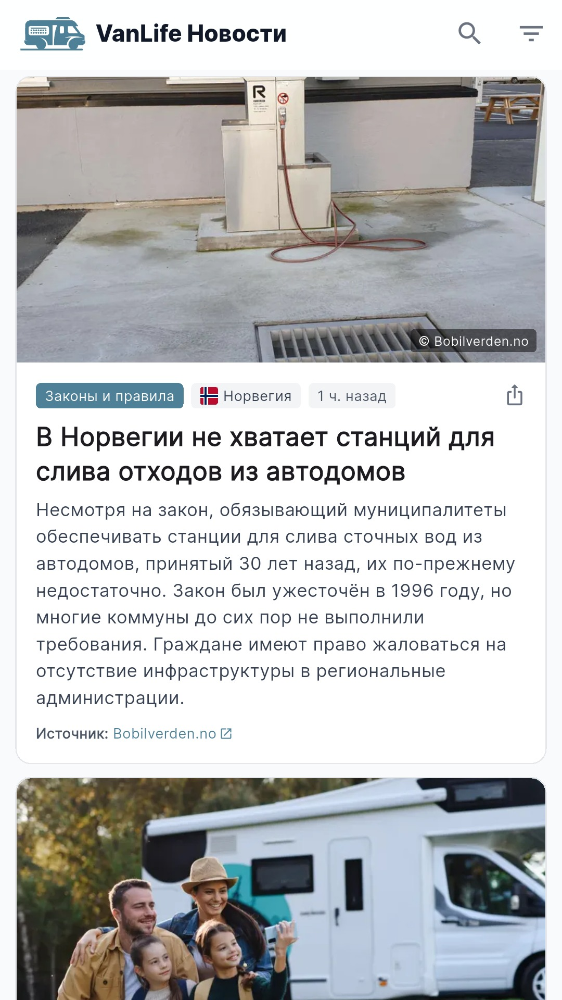
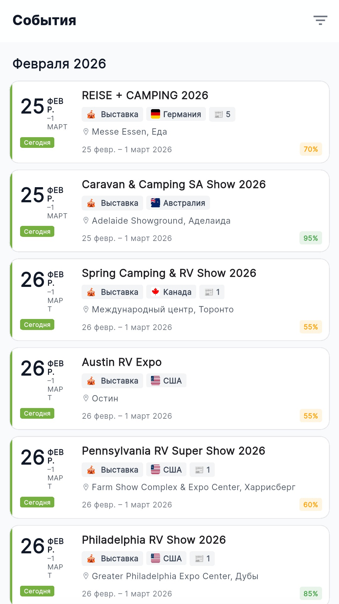
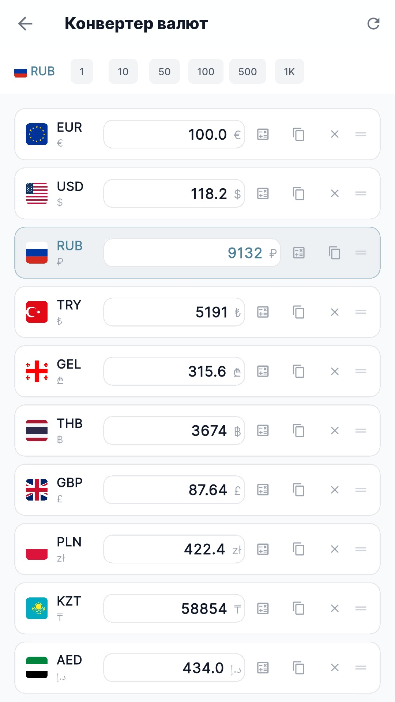
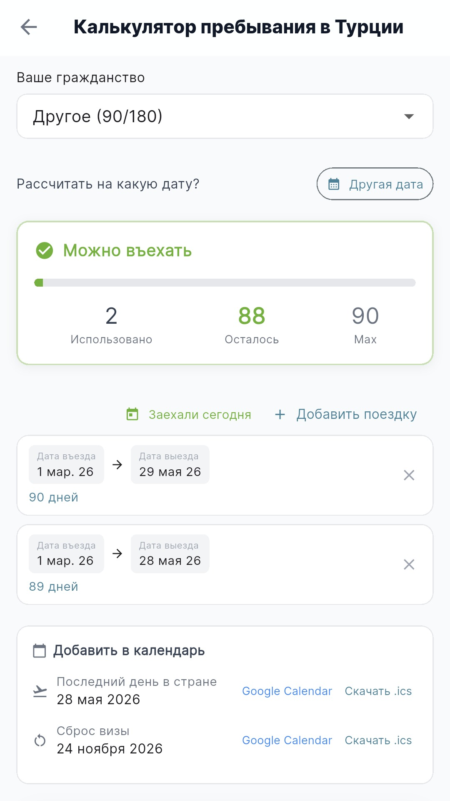

<div align="center">


# VanLife

**News, events & tools for van life travelers**

[](https://github.com/Kopaev/VanLife-App-Releases/releases/latest)
[](https://github.com/Kopaev/VanLife-App-Releases/releases)
[](https://github.com/Kopaev/VanLife-App-Releases/releases/latest)

[**⬇ Download APK**](https://github.com/Kopaev/VanLife-App-Releases/releases/latest/download/VanLife.apk) &nbsp;·&nbsp;
[All releases](https://github.com/Kopaev/VanLife-App-Releases/releases) &nbsp;·&nbsp;
[Website](https://coffee.bez.coffee)

</div>

---

## Screenshots

<div align="center">
<table>
  <tr>
    <td align="center"><br/><sub>News Feed</sub></td>
    <td align="center"><br/><sub>Events</sub></td>
    <td align="center"><br/><sub>Currency Converter</sub></td>
    <td align="center"><br/><sub>Visa Calculator</sub></td>
  </tr>
</table>
</div>

---

## Features

| | |
|---|---|
| 📰 **News Feed** | Aggregated van life news with filters by country, category, and language |
| 📅 **Events** | Upcoming camping fairs, RV shows, and meetups worldwide |
| 💱 **Currency Converter** | 24 currencies with offline support and drag-to-reorder |
| 🛂 **Visa Calculators** | Turkey 90/180 rule, Schengen 90/180, Russia 90/year |
| 🌙 **Dark Mode** | Full dark theme support |
| 🌍 **7 Languages** | English · Русский · Deutsch · Français · Español · Português · Türkçe |

---

## Install

1. Download `VanLife-vX.X.X.apk` from the [latest release](https://github.com/Kopaev/VanLife-App-Releases/releases/latest)
2. Open the downloaded file on your Android device
3. If prompted, tap **Install anyway** or allow installation from unknown sources in Settings → Security
4. Done!

> **Minimum Android version:** 6.0 (API 23)

---

## Download

**Direct link (always points to the latest version):**

```
https://github.com/Kopaev/VanLife-App-Releases/releases/latest/download/VanLife.apk
```

---

<div align="center">
<sub>Source code is in a private repository. Releases are published here automatically via GitHub Actions.</sub>
</div>
